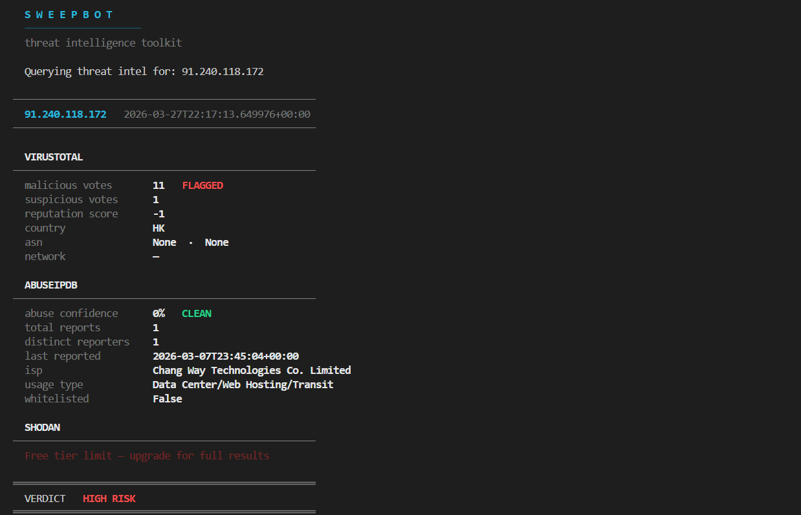
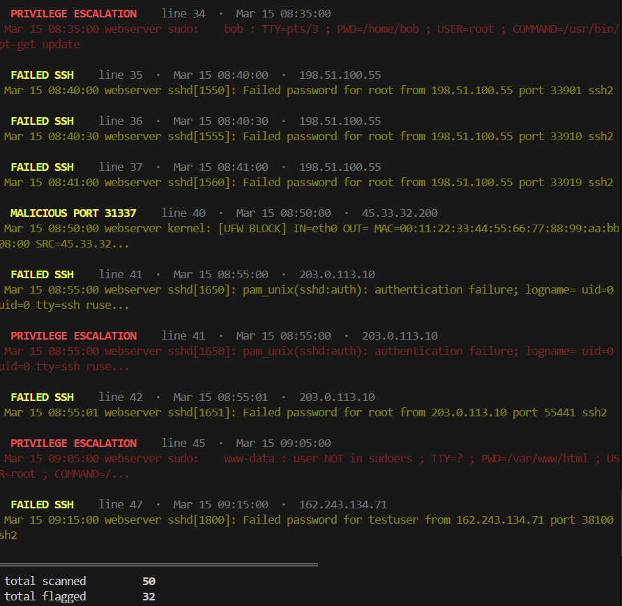

# SweepBot

Threat intelligence and log analysis toolkit for SOC analysts and security investigators. Query multiple threat intel sources from one command, or scan log files for suspicious activity without reading thousands of lines manually.

## Why This Exists

Anyone who has done threat investigation knows how repetitive the process is. You get a suspicious IP, you open VirusTotal, check it, open AbuseIPDB, check it again, open Shodan, check it again. Copy the results somewhere. Try to figure out if the thing is actually dangerous. One IP takes 15 to 20 minutes. Do that 20 times in a shift and most of your day is gone.

On top of that, analysts spend hours reading through massive log files trying to find the one suspicious line buried in thousands of normal entries.

SweepBot handles both. Module 1 checks threat intel sources in one command. Module 2 scans your logs and flags what matters.

## Module 1: Threat Intel Lookup

Give it an IP address and it queries VirusTotal, AbuseIPDB, and Shodan at the same time. One command, one report.



## Module 2: Log Parser

Feed it a log file and it scans every line for suspicious activity. Flags failed SSH attempts, brute force patterns, malicious ports, privilege escalation, and reverse shell commands. Tells you exactly which line, what time, what IP, and why it got flagged.



## Requirements

- Python 3.8 or higher
- pip (comes with Python)
- Free API keys from VirusTotal, AbuseIPDB, and Shodan (for Module 1)

## Installation

### Windows

Open Command Prompt or PowerShell.

```bash
git clone https://github.com/oxajamal-byte/SweepBot.git
cd SweepBot
py -m pip install -r requirements.txt
```

If `py` doesn't work, try `python` instead. If neither works, you need to install Python from [python.org](https://www.python.org/downloads/) and make sure you check "Add Python to PATH" during installation.

### macOS

Open Terminal.

```bash
git clone https://github.com/oxajamal-byte/SweepBot.git
cd SweepBot
python3 -m pip install -r requirements.txt
```

If you don't have Python 3 installed, the easiest way is through Homebrew:

```bash
brew install python3
```

### Linux

Open your terminal.

```bash
git clone https://github.com/oxajamal-byte/SweepBot.git
cd SweepBot
python3 -m pip install -r requirements.txt
```

On Debian/Ubuntu, if Python or pip isn't installed:

```bash
sudo apt update
sudo apt install python3 python3-pip
```

On Fedora/RHEL:

```bash
sudo dnf install python3 python3-pip
```

## API Keys (Module 1 only)

Module 2 doesn't need API keys. It works entirely offline on local log files.

Module 1 needs API keys to talk to the threat intelligence services. All three have free tiers.

Sign up and grab your keys from:
- [VirusTotal](https://www.virustotal.com/gui/join-us) (500 requests/day free)
- [AbuseIPDB](https://www.abuseipdb.com/register) (1,000 checks/day free)
- [Shodan](https://account.shodan.io/register) (100 queries/month free)

Once you have them, copy the example env file and add your keys:

```bash
cp .env.example .env
```

On Windows if `cp` doesn't work:

```bash
copy .env.example .env
```

Open the `.env` file in any text editor and replace the placeholders with your real keys:

```
VIRUSTOTAL_API_KEY=your_actual_key_here
ABUSEIPDB_API_KEY=your_actual_key_here
SHODAN_API_KEY=your_actual_key_here
```

Save it. This file is in `.gitignore` so your keys stay on your machine and never get pushed to GitHub.

## Usage

### Threat Intel Lookup (Module 1)

```bash
py -m sweepbot lookup --ip 185.220.101.34
```

Skip saving the report to a file:

```bash
py -m sweepbot lookup --ip 185.220.101.34 --no-save
```

On macOS/Linux use `python3` instead of `py`.

### Log Parser (Module 2)

```bash
py -m sweepbot parse --file /path/to/auth.log
```

Save the results to a JSON file:

```bash
py -m sweepbot parse --file /path/to/auth.log --output results.json
```

Try it with the included sample log:

```bash
py -m sweepbot parse --file sample_logs/example_auth.log
```

On macOS/Linux use `python3` instead of `py`.

### Run Tests

```bash
py -m pytest tests/ -v
```

## How It Works

### Module 1: Threat Intel Lookup

1. You run the command with an IP address
2. SweepBot loads your API keys from the .env file
3. It sends requests to all three APIs at the same time using threads so one slow API doesn't hold up the others
4. Each API sends back JSON data about the IP
5. SweepBot pulls out the important fields from each response and puts them into one report
6. A risk verdict gets calculated from the combined results
7. The report prints to your terminal and saves as a JSON file

If one API is down or throws an error, the other two still run and you still get results.

### Module 2: Log Parser

1. You point it at a log file
2. It reads every line and runs it through a set of detection rules
3. Each rule looks for a specific pattern using regex (text matching)
4. Failed SSH logins, privilege escalation attempts, suspicious ports, and dangerous commands all get flagged
5. After scanning every line individually, it does a second pass to detect brute force by counting how many times each IP failed to log in
6. If an IP failed more than 5 times, it gets flagged as brute force
7. Everything gets displayed with color coding, red for critical, yellow for suspicious

## What Each Module Detects

### Module 1 sources

**VirusTotal** runs the IP against dozens of antivirus vendors and security tools. It shows how many flagged it as malicious, the reputation score, and what country and network it belongs to.

**AbuseIPDB** is a community database where analysts report IPs that are doing sketchy stuff. It gives you an abuse confidence score from 0 to 100%, how many people reported it, what ISP owns it, and when it was last reported.

**Shodan** scans the internet and keeps track of what services are running on every IP. It shows open ports, what software is on those ports, who owns the IP, and any known vulnerabilities.

### Module 2 detection rules

- **Failed SSH** flags any line containing "Failed password" or "authentication failure"
- **Brute Force** flags when the same IP has more than 5 failed login attempts
- **Malicious Ports** flags connections to ports commonly used by attackers (4444, 5555, 6666, 1337, 31337)
- **Privilege Escalation** flags sudo attempts, unauthorized root access, and sudoers violations
- **Suspicious Commands** flags reverse shell commands like nc -e and base64 decode attempts

## Project Structure

```
SweepBot/
├── README.md
├── ARCHITECTURE.md
├── requirements.txt
├── .env.example
├── .gitignore
├── assets/
│   ├── sweepbot-output.png
│   └── sweepbot-logparser.png
├── sweepbot/
│   ├── __init__.py
│   ├── __main__.py
│   ├── main.py
│   ├── threat_lookup.py
│   ├── log_parser.py
│   └── utils.py
├── sample_logs/
│   └── example_auth.log
├── reports/
│   └── .gitkeep
└── tests/
    ├── test_lookup.py
    └── test_parser.py
```

## Coming Soon

**Daily Threat Brief** that pulls from public threat feeds and puts together a quick summary of what threats are active right now.

**Bulk Lookups** so you can pass in a list of IPs instead of doing them one at a time.

**PDF Export** to generate reports you can share with people who don't want to read JSON.

## Contributing

If you want to add a feature or fix something, open a pull request. Keep the code clean and test anything you add.

## License

MIT License
